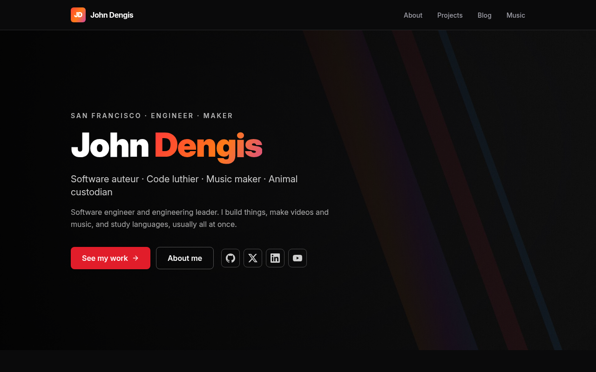

# john.deng.is

The source for [john.deng.is](https://john.deng.is) — the personal site of John Dengis: software engineer and engineering leader, YouTuber, guitarist, and language learner.

Built as a full-stack [React Router v7](https://reactrouter.com/) app with server-side rendering, an MDX-powered blog, and SEO/feed generation, deployed to [Fly.io](https://fly.io).



## Tech stack

- **[React Router v7](https://reactrouter.com/)** — full-stack framework with SSR enabled
- **[React 19](https://react.dev/)** + **TypeScript**
- **[TailwindCSS v4](https://tailwindcss.com/)** — dark mode via `prefers-color-scheme`
- **[MDX](https://mdxjs.com/)** — blog posts authored in Markdown + JSX, with frontmatter, GFM, autolinked headings, and syntax highlighting via [rehype-pretty-code](https://rehype-pretty.pages.dev/) / [Shiki](https://shiki.style/)
- **[lucide-react](https://lucide.dev/)** — icons
- **[feed](https://github.com/jpmonette/feed)** — RSS generation

## Getting started

Uses [`pnpm`](https://pnpm.io/) (pinned via `packageManager` in `package.json`; enable with `corepack enable`). Node 24 (see `.tool-versions`).

```bash
pnpm install      # Install dependencies
pnpm dev          # Start dev server with HMR at http://localhost:5173
pnpm build        # Production build (outputs to ./build/)
pnpm start        # Serve the production build
pnpm typecheck    # Generate React Router types + run TypeScript check
pnpm format       # Format with Prettier
```

## Project structure

```
app/
├── root.tsx              # HTML document shell, root App, global ErrorBoundary
├── routes.ts             # Declarative route config
├── app.css               # Global styles + Tailwind import
├── routes/               # Route modules (loader / action / meta / component)
│   ├── layout.tsx        # Shared chrome (header, footer) wrapping page routes
│   ├── home.tsx          # /
│   ├── about.tsx         # /about
│   ├── projects.tsx      # /projects
│   ├── music.tsx         # /music
│   ├── blog/             # /blog and /blog/:slug
│   ├── rss.xml.tsx       # RSS feed (resource route, no layout)
│   └── sitemap.xml.tsx   # Sitemap (resource route, no layout)
├── components/           # Reusable components
│   └── ui/               # Design-system primitives
├── content/blog/         # Blog posts as .mdx files with frontmatter
└── lib/                  # Site config, post/project data, helpers
```

### Routing

Routes are declared in `app/routes.ts`. Page routes are nested under `routes/layout.tsx` for shared chrome; `rss.xml` and `sitemap.xml` are resource routes that return raw XML. The `~/` path alias maps to `app/`.

### Blog

Posts live in `app/content/blog/*.mdx`. Each file carries frontmatter (`title`, `date`, `description`, `image`, `tags`, `published`). `app/lib/posts.ts` reads frontmatter via `import.meta.glob` to build the post list, sorted newest-first. Posts with `published: false` are shown in development but hidden in production. Post images live under `public/images/blog/<slug>/`.

### SEO

Per-page `meta`, JSON-LD structured data (`app/components/jsonld.tsx`), Open Graph images (`public/og/`), `robots.txt`, an RSS feed at `/rss.xml`, and a sitemap at `/sitemap.xml`.

## Deployment

The app runs on [Fly.io](https://fly.io) (`fly.toml`, app `john-dengis-www`). The `Dockerfile` is a multi-stage build that installs production deps, builds the app, and serves it with `react-router-serve`.

Pushes to `master` trigger the **Deploy** GitHub Actions workflow (`.github/workflows/`), which runs `flyctl deploy --remote-only` and stamps the build with the commit SHA as `RELEASE`. Deploying requires a `FLY_API_TOKEN` repository secret.

To deploy manually:

```bash
fly deploy
```

Or build and run the container locally:

```bash
docker build -t www .
docker run -p 3000:3000 www
```
